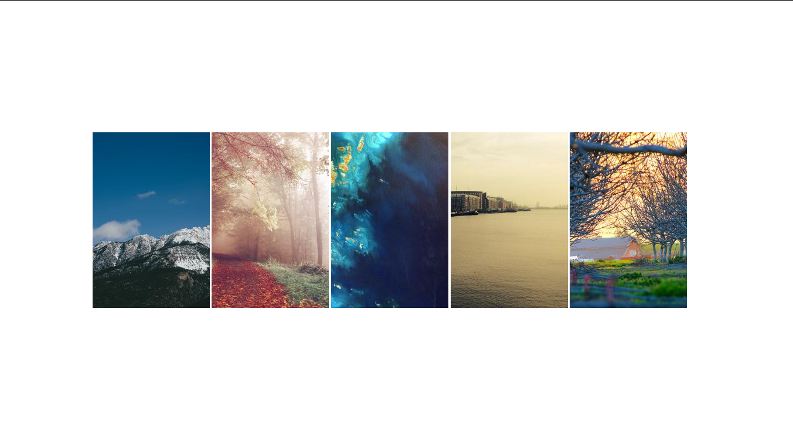

#Wallpaper-generator

Random Images taken from [Picsum](https://picsum.photos) and put together with html+css then converted to .png with python

Samples:

It works only with Python 3.5 or above.

Clone the repo with :

[git clone https://github.com/Vaibhav21pandit/wallpaper-generator/edit/main/README.md]

Signup on htmlcsstoimages.com and get your UserId and API-key, copy them down somewhere.

Run the script with:

[python main.py]

When prompted enter the corresponding keys.

After the program exits, you will find a new wallpaper in your wallpaper directory.

Happy scening!!!
