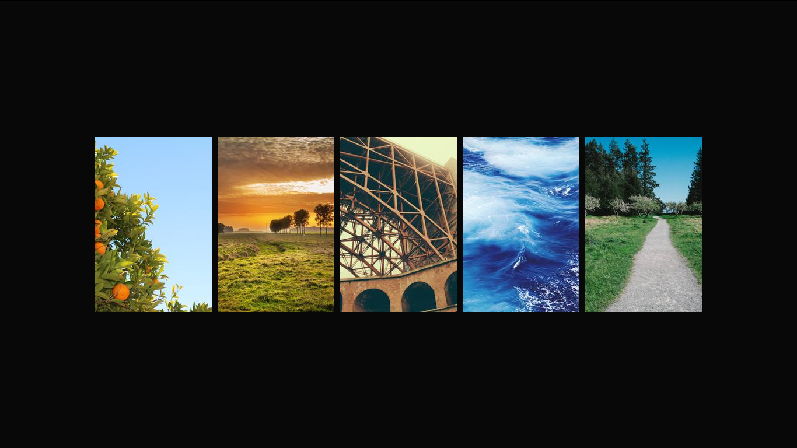

#Wallpaper-generator

Random Images taken from [Picsum](https://picsum.photos) and put together with html+css then converted to .png with python

Samples:

[How It works](https://vaibhavpandit.space/blog/building-wallpaper-generator)
